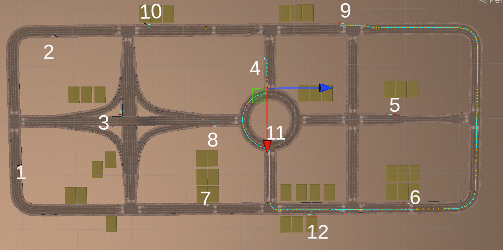
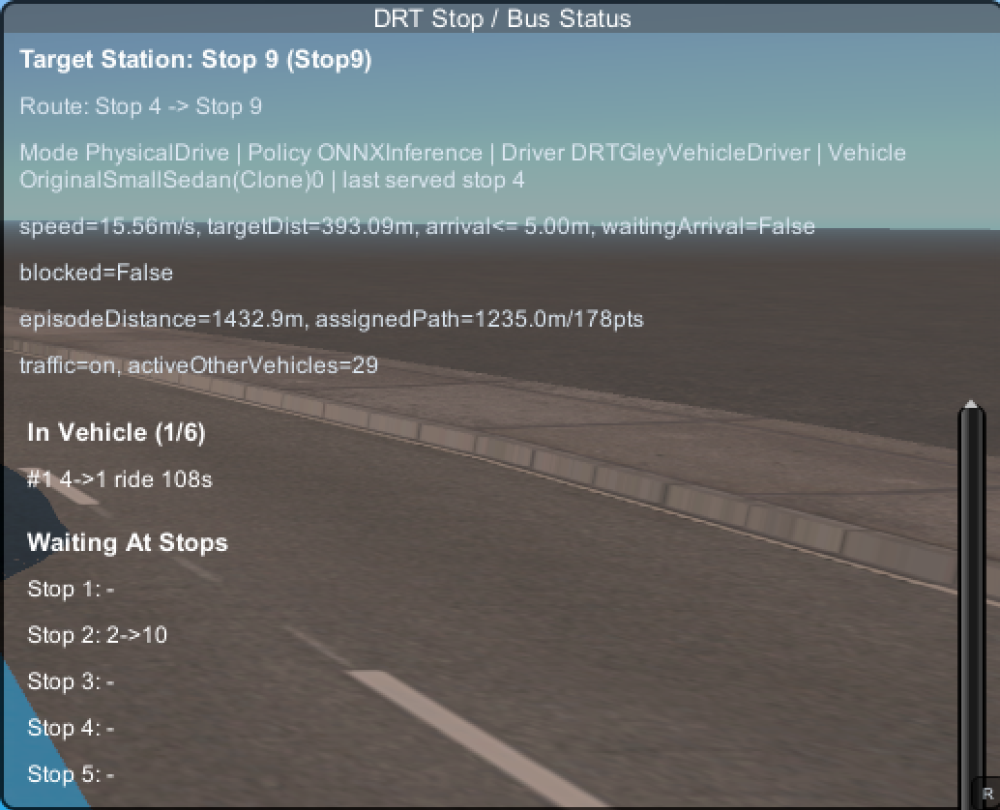

# DRT Bus Dynamic Routing Simulation

Unity와 ML-Agents PPO를 사용해 DRT(Demand Responsive Transit) 버스의 다음 정류장을 동적으로 선택하고, 고정 순환 노선 대비 대기시간, 이동거리, 운행시간을 비교하는 시뮬레이션 프로젝트입니다.

| Scene View | Game View |
|---|---|
|  |  |

## What This Project Does

이 프로젝트는 정해진 순서로 모든 정류장을 도는 버스가 아니라, 현재 승객 수요와 차량 상태를 보고 다음으로 방문할 정류장을 선택하는 DRT 버스 운영 환경을 구현합니다.

- Unity 기반 도로/정류장/차량 시뮬레이션 로직
- Unity ML-Agents PPO 기반 다음 정류장 선택 정책
- CSV 승객 수요 시나리오 재생
- ONNX 추론 정책과 Vanilla Sequential baseline 비교
- 서비스율, 평균 대기시간, 승차시간, 이동거리, route leg, reward 지표 기록
- Gley Traffic System과 연동되는 차량 주행 실험 코드

## External Asset Notice

Gley Traffic System은 Unity Asset Store 유료 에셋이므로 이 공개 저장소에는 포함하지 않습니다.

이 저장소에는 DRT 제어 로직, ML-Agents 설정, 수요 CSV, 학습/추론 관련 코드만 남겨두었습니다. 실제 Unity 씬을 실행하려면 Gley Traffic System을 별도로 보유한 환경에서 `Assets/Gley/` 아래에 에셋을 다시 import하고, 해당 에셋과 호환되는 씬을 구성해야 합니다.

## Core Idea

DRT 버스는 매 의사결정 시점마다 현재 정류장, 탑승 중인 승객, 대기 승객, 예약된 수요, 남은 좌석, 예상 이동 정보를 관찰합니다. PPO agent는 이 상태를 바탕으로 다음 정류장 index를 선택하고, 잘못된 정류장 선택은 action mask로 제한합니다.

목표는 단순히 가까운 정류장으로 이동하는 것이 아니라, 대기 승객 픽업과 탑승 승객 하차를 함께 고려해 전체 서비스 품질을 높이는 것입니다.

## Main Components

| Component | Role |
|---|---|
| `DRTBusController` | episode 진행, 버스 상태, 운행 모드, metric export 관리 |
| `DRTNextStopSelector` | PPO 기반 다음 정류장 선택 agent |
| `DRTDemandGenerator` | CSV 또는 Inspector 기반 승객 수요 생성 |
| `DRTPassengerManager` | 승객 상태 전이와 승하차 처리 |
| `DRTStopTravelTimeMatrix` | 정류장 간 이동시간 matrix 조회 |
| `DRTDebugGUI` | passenger/status panel을 통한 실행 상태 확인 |

## MDP Summary

| Item | Design |
|---|---|
| Agent | `DRTNextStopSelector` |
| Algorithm | PPO, Unity ML-Agents |
| Environment | Unity + external traffic simulation asset |
| State: Bus | current stop, episode time, service rate |
| State: Capacity | waiting ratio, onboard ratio, remaining capacity ratio |
| State: Stop | valid flag, current-stop flag, travel feature |
| State: Demand | waiting passengers, dropoff targets, scheduled demand |
| State: Time | max wait time, max ride time |
| Action | next stop index |
| Action Mask | invalid stop, current stop |
| Training Policy | `MLAgentsTraining` |
| Inference Policy | `ONNXInference` |
| Baseline | `VanillaSequential` |
| Done | all requests completed, time limit, vehicle fault, invalid route |

## Reward / Penalty

```text
R_stop = boarding_reward + dropoff_reward - unboarded_passenger_penalty
```

| Term | Meaning |
|---|---|
| Boarding Reward | 정류장에서 대기 승객을 태웠을 때의 보상 |
| Dropoff Reward | 탑승 승객을 목적지에 하차시켰을 때의 보상 |
| Waiting Penalty | 서비스되지 않은 승객 대기시간에 대한 penalty |
| Failure Penalty | 차량 fault, route failure 등에 대한 penalty |

## Passenger Request Panel


승객 요청 상태를 확인하는 panel입니다.

- 승객 ID
- 출발 정류장과 도착 정류장
- 요청 발생 시간
- 현재 상태
- pickup/dropoff 시간
- 대기시간과 승차시간

승객 상태 흐름:

```text
Scheduled -> Waiting -> OnBoard -> Completed
```

## DRT Bus Status Panel



버스 운행과 정책 실행 상태를 확인하는 panel입니다.

- 실행 모드: `MatrixTeleport`, `PhysicalDrive`, `Train`
- 정책 모드: `MLAgentsTraining`, `ONNXInference`, `VanillaSequential`
- 현재 정류장과 마지막 처리 정류장
- episode 누적 주행거리
- 현재 assigned path 정보
- 탑승 중, 대기 중, 완료된 승객 수
- 정류장별 demand 상태

확인 포인트는 학습 정책이 단순 순환이 아니라, 수요가 높은 정류장을 우선 선택하는지입니다.

## Experiment Setup

기준 실험 조건:

- 12 stops
- 1 DRT bus
- 30 passengers scenario
- `MatrixTeleport` execution
- `DRTNextStopPPO-70999.onnx`
- Vanilla Sequential baseline vs ONNX Inference

수요 파일은 `Assets/DRT/Resources/` 아래 CSV로 관리합니다. 대표 시나리오는 14, 18, 22, 30, 40, 50 passengers입니다.

## Result Summary

| Metric | Vanilla Sequential | ONNX Inference | Change |
|---|---:|---:|---:|
| Service rate | 1.000 | 1.000 | Tie |
| Episode distance | 43,424.14 m | 36,710.15 m | -15.5% |
| Episode time | 2,894.94 s | 2,447.34 s | -15.5% |
| Average wait | 340.16 s | 131.88 s | -61.2% |
| P95 wait | 750.39 s | 333.46 s | -55.6% |
| Average ride | 294.07 s | 216.14 s | -26.5% |
| Route legs | 62.00 | 51.50 | -16.9% |
| Reward | -476.00 | 172.83 | ONNX better |

동일한 service rate를 유지하면서 ONNX 정책은 평균 대기시간, 이동거리, episode time, route leg 수를 줄이는 방향으로 동작했습니다.

## Project Files

| Path | Purpose |
|---|---|
| `Assets/DRT/Scripts/` | DRT simulation, passenger flow, policy, export logic |
| `Assets/DRT/Resources/` | passenger demand CSV and travel-time matrix |
| `Assets/DRT/DRT onnx files/` | trained ONNX policy files |
| `config/` | ML-Agents PPO training configs |
| `docs/` | state/reward notes and README assets |

## Run Environment

- Unity `2022.3.62f3`
- Unity ML-Agents
- Gley Traffic System, installed separately from the Unity Asset Store

This public repository does not include the paid Gley asset files. Import them locally before opening or reconstructing the original simulation scene.
